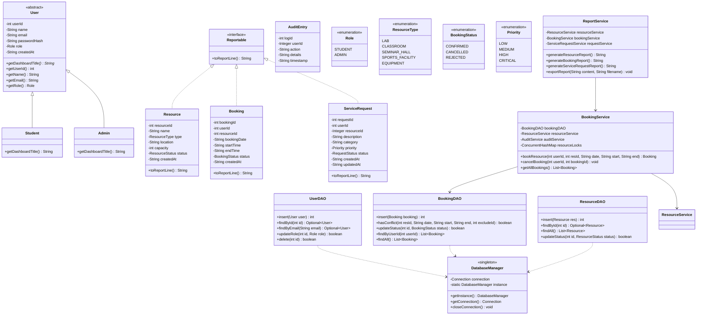

# Class Diagram

The following class diagram models the structural relationships across Domain Models, Interfaces, DAOs, Services, and Utilities.

```mermaid
classDiagram
    %% Interfaces & Abstract Classes
    class Reportable {
        <<interface>>
        +toReportLine() String
    }

    class User {
        <<abstract>>
        -int userId
        -String name
        -String email
        -String passwordHash
        -Role role
        -String createdAt
        +getDashboardTitle()* String
        +getUserId() int
        +getName() String
        +getEmail() String
        +getRole() Role
    }

    class Student {
        +getDashboardTitle() String
    }

    class Admin {
        +getDashboardTitle() String
    }

    User <|-- Student
    User <|-- Admin

    %% Domain Entities
    class Resource {
        -int resourceId
        -String name
        -ResourceType type
        -String location
        -int capacity
        -ResourceStatus status
        -String createdAt
        +toReportLine() String
    }

    class Booking {
        -int bookingId
        -int userId
        -int resourceId
        -String bookingDate
        -String startTime
        -String endTime
        -BookingStatus status
        -String createdAt
        +toReportLine() String
    }

    class ServiceRequest {
        -int requestId
        -int userId
        -Integer resourceId
        -String description
        -String category
        -Priority priority
        -RequestStatus status
        -String createdAt
        -String updatedAt
        +toReportLine() String
    }

    class AuditEntry {
        -int logId
        -Integer userId
        -String action
        -String details
        -String timestamp
    }

    Reportable <|.. Resource
    Reportable <|.. Booking
    Reportable <|.. ServiceRequest

    %% Enumerations
    class Role {
        <<enumeration>>
        STUDENT
        ADMIN
    }

    class ResourceType {
        <<enumeration>>
        LAB
        CLASSROOM
        SEMINAR_HALL
        SPORTS_FACILITY
        EQUIPMENT
    }

    class BookingStatus {
        <<enumeration>>
        CONFIRMED
        CANCELLED
        REJECTED
    }

    class Priority {
        <<enumeration>>
        LOW
        MEDIUM
        HIGH
        CRITICAL
    }

    %% DAOs
    class UserDAO {
        +insert(User user) int
        +findById(int id) Optional~User~
        +findByEmail(String email) Optional~User~
        +updateRole(int id, Role role) boolean
        +delete(int id) boolean
    }

    class BookingDAO {
        +insert(Booking booking) int
        +hasConflict(int resId, String date, String start, String end, int excludeId) boolean
        +updateStatus(int id, BookingStatus status) boolean
        +findByUserId(int userId) List~Booking~
        +findAll() List~Booking~
    }

    class ResourceDAO {
        +insert(Resource res) int
        +findById(int id) Optional~Resource~
        +findAll() List~Resource~
        +updateStatus(int id, ResourceStatus status) boolean
    }

    %% Services
    class BookingService {
        -BookingDAO bookingDAO
        -ResourceService resourceService
        -AuditService auditService
        -ConcurrentHashMap resourceLocks
        +bookResource(int userId, int resId, String date, String start, String end) Booking
        +cancelBooking(int userId, int bookingId) void
        +getAllBookings() List~Booking~
    }

    class ReportService {
        -ResourceService resourceService
        -BookingService bookingService
        -ServiceRequestService requestService
        +generateResourceReport() String
        +generateBookingReport() String
        +generateServiceRequestReport() String
        +exportReport(String content, String filename) void
    }

    class DatabaseManager {
        <<singleton>>
        -Connection connection
        -static DatabaseManager instance
        +getInstance() DatabaseManager
        +getConnection() Connection
        +closeConnection() void
    }

    BookingService --> BookingDAO
    BookingService --> ResourceService
    ReportService --> BookingService
    UserDAO ..> DatabaseManager
    BookingDAO ..> DatabaseManager
    ResourceDAO ..> DatabaseManager
```
