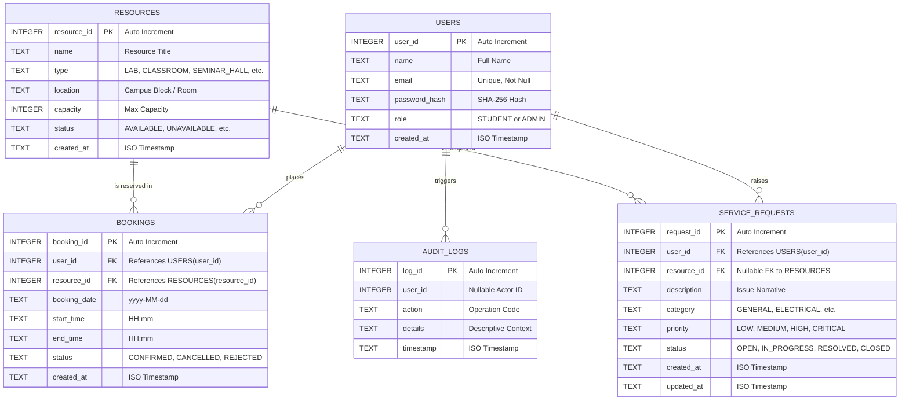

# Entity-Relationship (ER) Diagram

The following Entity-Relationship diagram outlines the logical data models, primary keys, foreign key constraints, and cardinalities implemented in the SQLite database schema.

