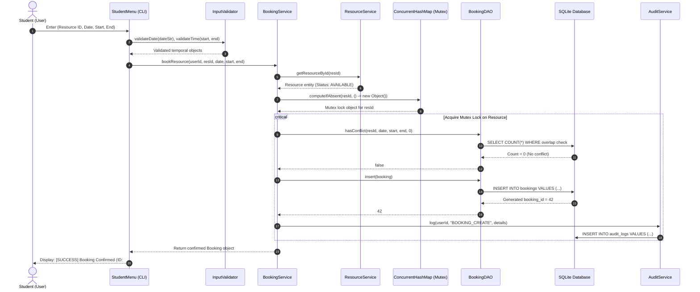

# Sequence Diagram: Thread-Safe Resource Booking Flow

The sequence diagram details the end-to-end execution path of a booking request, demonstrating input validation, resource status checks, fine-grained mutex lock acquisition, conflict detection, database insertion, and audit logging.

