# Use Case Diagram

The use case diagram illustrates the interactions between the system actors (**Student**, **Campus Administrator**, and **System/Timer**) and the core functional capabilities of the Smart Campus Resource & Service Management System.

```mermaid
graph TD
    subgraph Actors
        Student["Student (User)"]
        Admin["Campus Administrator"]
        Timer["System / Background Process"]
    end

    subgraph Authentication & Profile
        UC_Reg["Register Account"]
        UC_Login["Login & Establish Session"]
        UC_ViewProfile["View Personal Dashboard"]
    end

    subgraph Resource Management
        UC_BrowseRes["Browse & Filter Resources"]
        UC_AddRes["Add New Resource"]
        UC_UpdateRes["Update Resource Status"]
        UC_DeleteRes["Decommission Resource"]
    end

    subgraph Booking Engine
        UC_BookRes["Book Resource Slot"]
        UC_CancelBook["Cancel Own Booking"]
        UC_AdminBookStatus["Adjudicate Booking (Reject/Cancel)"]
        UC_SimulateRace["Run Concurrency Stress Demo"]
    end

    subgraph Service & Maintenance
        UC_RaiseReq["Raise Service Request"]
        UC_TrackReq["Track Own Service Requests"]
        UC_UpdateTicket["Update Status / Elevate Priority"]
    end

    subgraph Analytics & Governance
        UC_GenReports["Generate Streams Analytics Report"]
        UC_ExportReports["Export Reports to Disk"]
        UC_ViewAudit["Inspect System Audit Log"]
        UC_ViewStack["View Administrative Action History"]
    end

    %% Student Relationships
    Student --> UC_Reg
    Student --> UC_Login
    Student --> UC_ViewProfile
    Student --> UC_BrowseRes
    Student --> UC_BookRes
    Student --> UC_CancelBook
    Student --> UC_RaiseReq
    Student --> UC_TrackReq

    %% Admin Relationships
    Admin --> UC_Login
    Admin --> UC_BrowseRes
    Admin --> UC_AddRes
    Admin --> UC_UpdateRes
    Admin --> UC_DeleteRes
    Admin --> UC_AdminBookStatus
    Admin --> UC_SimulateRace
    Admin --> UC_UpdateTicket
    Admin --> UC_GenReports
    Admin --> UC_ExportReports
    Admin --> UC_ViewAudit
    Admin --> UC_ViewStack

    %% Internal System Actions
    UC_BookRes -.-> |"<<include>>"| UC_Audit["Log to Audit Trail"]
    UC_AddRes -.-> |"<<include>>"| UC_Audit
    UC_UpdateTicket -.-> |"<<include>>"| UC_Audit
```

