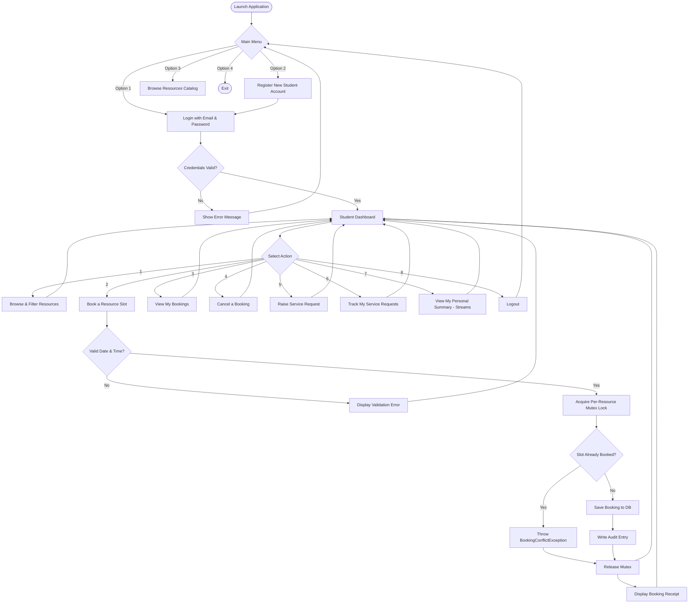
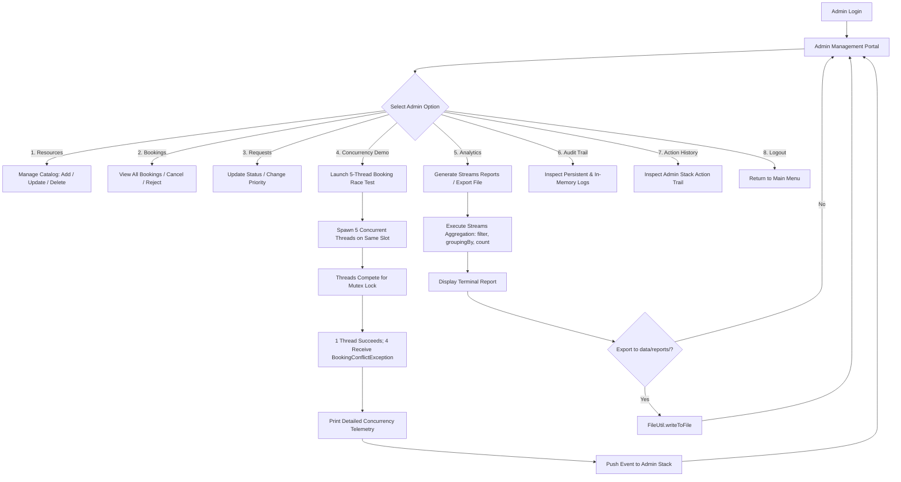

# System Workflows & Activity Diagrams

## 1. Student User Workflow

```mermaid
flowchart TD
    Start([Launch Application]) --> MainMenu{Main Menu}
    MainMenu -->|Option 1| Login[Login with Email & Password]
    MainMenu -->|Option 2| Register[Register New Student Account]
    MainMenu -->|Option 3| GuestBrowse[Browse Resources Catalog]
    MainMenu -->|Option 4| Exit([Exit])

    Register --> Login
    Login --> AuthCheck{Credentials Valid?}
    AuthCheck -->|No| LoginFailed[Show Error Message] --> MainMenu
    AuthCheck -->|Yes| StudentPortal[Student Dashboard]

    StudentPortal --> SMenu{Select Action}
    SMenu -->|1| Browse[Browse & Filter Resources] --> StudentPortal
    SMenu -->|2| Book[Book a Resource Slot]
    SMenu -->|3| ViewBookings[View My Bookings] --> StudentPortal
    SMenu -->|4| CancelBooking[Cancel a Booking] --> StudentPortal
    SMenu -->|5| RaiseReq[Raise Service Request] --> StudentPortal
    SMenu -->|6| TrackReq[Track My Service Requests] --> StudentPortal
    SMenu -->|7| Summary[View My Personal Summary - Streams] --> StudentPortal
    SMenu -->|8| Logout[Logout] --> MainMenu

    Book --> ValidateInput{Valid Date & Time?}
    ValidateInput -->|No| ShowValErr[Display Validation Error] --> StudentPortal
    ValidateInput -->|Yes| LockRes[Acquire Per-Resource Mutex Lock]
    LockRes --> ConflictCheck{Slot Already Booked?}
    ConflictCheck -->|Yes| ConflictErr[Throw BookingConflictException] --> ReleaseLock[Release Mutex] --> StudentPortal
    ConflictCheck -->|No| InsertBooking[Save Booking to DB] --> LogAudit[Write Audit Entry] --> ReleaseLock --> ConfirmMsg[Display Booking Receipt] --> StudentPortal
```

---

## 2. Administrator Governance & Concurrency Demo Workflow

```mermaid
flowchart TD
    AdminLogin[Admin Login] --> AdminDashboard[Admin Management Portal]
    AdminDashboard --> AMenu{Select Admin Option}

    AMenu -->|1. Resources| ResModule[Manage Catalog: Add / Update / Delete]
    AMenu -->|2. Bookings| BookModule[View All Bookings / Cancel / Reject]
    AMenu -->|3. Requests| ReqModule[Update Status / Change Priority]
    AMenu -->|4. Concurrency Demo| RunDemo[Launch 5-Thread Booking Race Test]
    AMenu -->|5. Analytics| ReportModule[Generate Streams Reports / Export File]
    AMenu -->|6. Audit Trail| AuditModule[Inspect Persistent & In-Memory Logs]
    AMenu -->|7. Action History| StackModule[Inspect Admin Stack Action Trail]
    AMenu -->|8. Logout| ExitAdmin[Return to Main Menu]

    RunDemo --> SpawnThreads[Spawn 5 Concurrent Threads on Same Slot]
    SpawnThreads --> Race[Threads Compete for Mutex Lock]
    Race --> Result[1 Thread Succeeds; 4 Receive BookingConflictException]
    Result --> PrintSummary[Print Detailed Concurrency Telemetry]
    PrintSummary --> PushStack[Push Event to Admin Stack] --> AdminDashboard

    ReportModule --> Streams[Execute Streams Aggregation: filter, groupingBy, count]
    Streams --> DisplayASCII[Display Terminal Report]
    DisplayASCII --> ExportPrompt{Export to data/reports/?}
    ExportPrompt -->|Yes| WriteFile[FileUtil.writeToFile] --> AdminDashboard
    ExportPrompt -->|No| AdminDashboard
```
